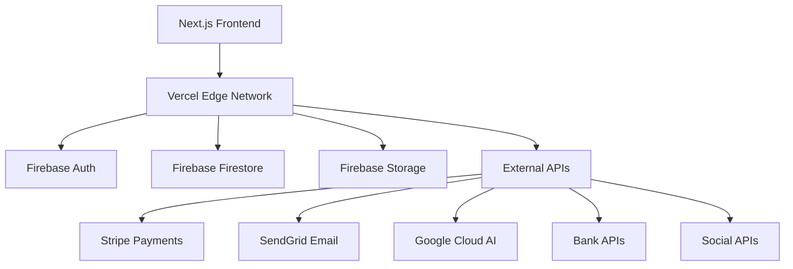

# Invox: Comprehensive Feature Set & Business Plan

## Executive Summary
Invox is the ultimate invoice management platform designed specifically for small entrepreneurs. By combining powerful features with an incredibly user-friendly interface, Invox will become the go-to solution for small business owners who want professional invoicing without the complexity.

## Target User Personas

### 1. **Sarah - The Solo Entrepreneur**
- **Profile**: 28-year-old freelance graphic designer, 2-3 years in business
- **Needs**: Simple invoicing, expense tracking, basic reporting
- **Pain Points**: Overwhelmed by complex accounting software, needs quick invoice creation
- **Tech Savvy**: Moderate, prefers intuitive interfaces

### 2. **Mike - The Small Business Owner**
- **Profile**: 45-year-old owner of local service business (plumbing/electrical), 5-10 employees
- **Needs**: Client management, recurring invoices, payment tracking, tax calculations
- **Pain Points**: Time-consuming manual processes, needs professional appearance
- **Tech Savvy**: Basic, values reliability over fancy features

### 3. **Jennifer - The Growing Consultant**
- **Profile**: 35-year-old management consultant, scaling from solo to small team
- **Needs**: Advanced analytics, multi-currency support, team collaboration features
- **Pain Points**: Outgrowing basic tools, needs scalable solution
- **Tech Savvy**: High, embraces new technologies

## Comprehensive Feature Set

### 1. Core Invoice Features

#### **Priority 1 (MVP)**
- ✅ **Smart Invoice Creation**: Drag-and-drop interface with auto-save
- ✅ **Professional Templates**: 10+ customizable templates with branding
- ✅ **Client Database**: CRM-lite with contact management and history
- ✅ **Payment Tracking**: Mark invoices as sent/paid with payment dates
- ✅ **PDF Export**: High-quality PDF generation with custom branding

#### **Priority 2**
- ⏳ **Invoice Status Workflow**: Draft → Sent → Viewed → Paid → Overdue
- ⏳ **Email Integration**: Send invoices directly from platform
- ⏳ **Payment Reminders**: Automated follow-up emails for overdue invoices
- ⏳ **Invoice History**: Complete audit trail for each invoice

#### **Priority 3**
- 📅 **Recurring Invoices**: Set up automatic recurring billing
- 📅 **Invoice Scheduling**: Schedule invoices to send on specific dates
- 📅 **Bulk Operations**: Create/edit multiple invoices simultaneously

### 2. Business Intelligence & Analytics

#### **Priority 1**
- ✅ **Basic Dashboard**: Revenue trends, outstanding payments, expense overview
- ✅ **Financial Reports**: Monthly/quarterly profit & loss statements
- ✅ **Expense Categories**: Automatic categorization with custom categories

#### **Priority 2**
- ⏳ **Advanced Analytics**: Cash flow projections, profitability analysis
- ⏳ **Tax Calculations**: Automatic tax calculations for multiple jurisdictions
- ⏳ **Custom Reports**: Build custom reports with drag-and-drop interface

#### **Priority 3**
- 📅 **AI-Powered Insights**: Predictive analytics for business trends
- 📅 **Benchmarking**: Compare performance against industry standards
- 📅 **Export Capabilities**: Export data to Excel, QuickBooks, Xero

### 3. User Experience Enhancements

#### **Priority 1**
- ✅ **Mobile-First Design**: Fully responsive design optimized for mobile
- ✅ **Intuitive Onboarding**: 5-minute setup wizard for new users
- ✅ **Dark Mode**: System preference detection with manual toggle

#### **Priority 2**
- ⏳ **Progressive Web App**: Installable on mobile devices
- ⏳ **Offline Mode**: Core functionality works without internet
- ⏳ **Voice Commands**: Voice-to-text for quick expense entry

#### **Priority 3**
- 📅 **AI Assistant**: Chatbot for help and quick actions
- 📅 **Keyboard Shortcuts**: Power user shortcuts for efficiency
- 📅 **Customizable Dashboard**: Drag-and-drop widget customization

### 4. Advanced Features

#### **Priority 1**
- ✅ **Multi-Currency Support**: Handle multiple currencies with auto-conversion
- ✅ **OCR Receipt Scanning**: Photo receipts auto-convert to expenses
- ✅ **Email Integration**: Connect Gmail/Outlook for automatic invoice tracking

#### **Priority 2**
- ⏳ **API Access**: REST API for integrations with other business tools
- ⏳ **Zapier Integration**: Connect with 2,000+ business apps
- ⏳ **Bank Sync**: Automatic import of bank transactions

#### **Priority 3**
- 📅 **Advanced Automation**: Custom workflow automation
- 📅 **Multi-User Teams**: Role-based access for team collaboration
- 📅 **White-Label Solution**: Custom branding for agencies

### 5. Marketing & Growth Features

#### **Priority 1**
- ✅ **Social Sharing**: Share business milestones on social media
- ✅ **Referral Program**: Earn credits for referring new users
- ✅ **Testimonials**: Showcase success stories and reviews

#### **Priority 2**
- ⏳ **Business Templates**: Industry-specific invoice templates
- ⏳ **Educational Content**: Blog posts, tutorials, and guides
- ⏳ **Community Features**: User forums and success stories

#### **Priority 3**
- 📅 **Affiliate Program**: Earn commissions for promoting Invox
- 📅 **Partner Integrations**: Official partnerships with complementary tools
- 📅 **Marketplace**: Third-party add-ons and integrations

## Monetization Strategy

### Free Tier (Forever Free)
**Target**: Individual freelancers and very small businesses
- 5 invoices per month
- 1 user account
- Basic templates only
- Community support
- Invox branding on invoices

### Professional Tier ($12/month)
**Target**: Growing small businesses
- Unlimited invoices
- 3 user accounts
- Premium templates
- Email integration
- Priority support
- Custom branding
- Basic analytics

### Business Tier ($29/month)
**Target**: Established small businesses
- Everything in Professional
- 10 user accounts
- Advanced analytics
- API access
- White-label options
- Phone support
- Advanced integrations

### Enterprise Tier ($99/month)
**Target**: Small businesses with teams
- Everything in Business
- Unlimited users
- Custom integrations
- Dedicated account manager
- SLA guarantees
- Advanced security features

### Revenue Projections
- **Year 1**: $2.4M ARR (20,000 customers)
- **Year 2**: $9.6M ARR (80,000 customers)
- **Year 3**: $28.8M ARR (240,000 customers)

## Implementation Roadmap

### Phase 1: Foundation (Months 1-3)
**Goal**: Launch MVP with core features
- ✅ Basic invoice creation and management
- ✅ Expense tracking with OCR
- ✅ User authentication and profiles
- ✅ Mobile-responsive design
- ✅ PDF generation and email sending

### Phase 2: Enhancement (Months 4-6)
**Goal**: Add business intelligence and UX improvements
- ⏳ Advanced analytics dashboard
- ⏳ Multi-currency support
- ⏳ Email integrations
- ⏳ Progressive Web App features
- ⏳ Premium templates

### Phase 3: Scale (Months 7-9)
**Goal**: Enterprise features and automation
- 📅 Recurring invoices
- 📅 API and integrations
- 📅 Team collaboration
- 📅 Advanced automation
- 📅 Marketing features

### Phase 4: Optimization (Months 10-12)
**Goal**: Performance and growth features
- 📅 AI-powered insights
- 📅 Advanced marketing tools
- 📅 Performance optimizations
- 📅 Enterprise security
- 📅 Global expansion features

## Technical Architecture

### Current Stack (From plan.md)
- **Frontend**: Next.js 15, TypeScript, Tailwind CSS
- **Backend**: Next.js API routes (serverless)
- **Database**: Firebase Firestore
- **Storage**: Firebase Storage
- **Auth**: Firebase Auth
- **External APIs**: Google Speech-to-Text, Google Vision API

### Enhanced Architecture

### Key Enhancements
- **Edge Computing**: Vercel Edge Network for global performance
- **Microservices**: Modular API architecture for scalability
- **AI Integration**: Google Cloud AI for intelligent features
- **Payment Processing**: Stripe for subscriptions and payments
- **Email Service**: SendGrid for transactional and marketing emails
- **Bank Integrations**: Plaid for automatic bank sync
- **Social APIs**: Facebook, Twitter, LinkedIn for social sharing

### Security & Compliance
- SOC 2 Type II compliance
- GDPR and CCPA compliance
- End-to-end encryption
- Regular security audits
- Multi-factor authentication
- Data backup and disaster recovery

## Marketing & Growth Strategy

### Digital Marketing
- **Content Marketing**: SEO-optimized blog with invoicing tips
- **Social Media**: LinkedIn and Twitter campaigns targeting entrepreneurs
- **PPC Advertising**: Google Ads targeting "invoice software" keywords
- **Email Marketing**: Monthly newsletter with business tips

### Partnership Strategy
- **Accounting Software**: Integrations with QuickBooks, Xero, FreshBooks
- **Bank Partnerships**: Direct integrations with major banks
- **Business Associations**: Partnerships with SBA, local chambers of commerce
- **Influencer Marketing**: Collaborate with business influencers

### User Acquisition Channels
1. **Organic Search**: SEO for long-tail keywords
2. **Content Marketing**: Educational blog and YouTube channel
3. **Social Proof**: Testimonials and case studies
4. **Referral Program**: 20% discount for successful referrals
5. **Partnerships**: Bundled offerings with complementary tools

### Growth Metrics
- **Month 1-3**: 1,000 sign-ups, 60% activation rate
- **Month 4-6**: 5,000 users, 40% conversion to paid
- **Month 7-12**: 20,000 users, 50% monthly growth
- **Year 2**: 100,000 users, established market leader

## Competitive Advantages

### 1. **User-Centric Design**
- Built specifically for small business owners, not enterprise
- Intuitive interface that requires no training
- Mobile-first approach for on-the-go entrepreneurs

### 2. **AI-Powered Features**
- OCR for receipt scanning
- Smart categorization of expenses
- Predictive analytics for cash flow
- Voice-to-text for quick entry

### 3. **Comprehensive Solution**
- All-in-one platform: invoicing + expenses + analytics
- No need for multiple tools or complex integrations
- Seamless workflow from quote to payment

### 4. **Transparent Pricing**
- Forever free tier for basic needs
- Clear value proposition at each tier
- No hidden fees or surprise charges

### 5. **Community Focus**
- Built by entrepreneurs for entrepreneurs
- Active user community and support
- Regular feature requests incorporated

## Risk Mitigation

### Technical Risks
- **Scalability**: Edge computing and microservices architecture
- **Data Security**: SOC 2 compliance and regular audits
- **API Reliability**: Multiple fallback providers for external services

### Business Risks
- **Competition**: Differentiate through user experience and AI features
- **Market Adoption**: Focus on education and testimonials
- **Economic Downturn**: Free tier ensures accessibility during tough times

### Operational Risks
- **Team Growth**: Hire experienced entrepreneurs, not just developers
- **Customer Support**: 24/7 support with AI chatbots and human escalation
- **Product Development**: Agile methodology with user feedback loops

## Success Metrics

### Product Metrics
- **User Engagement**: 70% monthly active users
- **Feature Adoption**: 60% use advanced features within 30 days
- **Mobile Usage**: 40% of sessions from mobile devices

### Business Metrics
- **Revenue Growth**: 300% YoY growth in first 2 years
- **Customer Acquisition Cost**: <$50 per customer
- **Lifetime Value**: $480 per customer (40 months average)
- **Churn Rate**: <5% monthly for paid users

### Quality Metrics
- **Uptime**: 99.9% service availability
- **Response Time**: <2 second average page load
- **Customer Satisfaction**: 4.8/5 star rating

## Conclusion

Invox represents a unique opportunity to capture the small business invoicing market by focusing on user experience, comprehensive features, and transparent pricing. With a clear roadmap, strong technical foundation, and entrepreneurial focus, Invox is positioned to become the market leader in small business invoicing software.

The combination of AI-powered features, mobile-first design, and all-in-one functionality addresses the key pain points of small business owners while providing a scalable platform for growth. The monetization strategy balances accessibility with profitability, ensuring long-term sustainability.

By executing this plan diligently and staying focused on user needs, Invox will not just be another invoicing tool—it will be the platform that small entrepreneurs love to use and recommend to others.